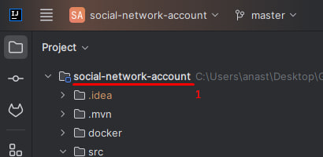
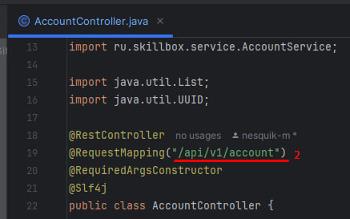
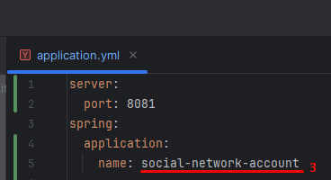

## Добавление нового маршрута в Spring Cloud Gateway

1. Переходим в GatewayConfig -> бин RouteLocator:

```
@Bean
public RouteLocator routes(RouteLocatorBuilder builder) {
   return builder.routes()
           .route("social-network-account",
                   r -> r.path("/api/v1/account/**")
                           .uri("lb://SOCIAL-NETWORK-ACCOUNT"))
           // Добавьте новый маршрут здесь
           .build();
}
```
2. Создаем новый маршрут:
```
.route("new-route-name", // Уникальное имя маршрута (задается произвольно, но для единообразия скопируйте название своего сервиса - см. скрин 1)
    r -> r.path("/api/v2/another-service/**") // Шаблон пути для маршрутизации (прописываем базовый путь из контроллера, не забудем добавить ** - см. скрин 2)
        .uri("lb://ANOTHER-SERVICE")) // URI сервиса, куда нужно перенаправить (ИМЯ ВАШЕГО СЕРВИСА, которое зарегистрировано в eureka - см. скрин 3)
```
- скрин 1:


- скрин 2:


- скрин 3:


